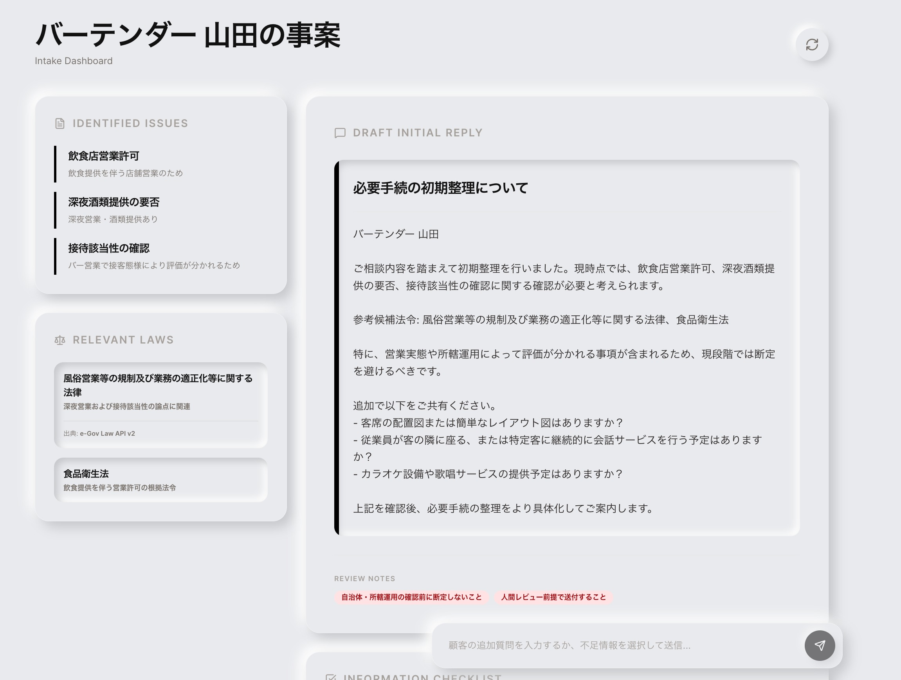

# e-gov Intake Dashboard

士業における初回相談について、**論点整理・関連法令の洗い出し・確認事項の列挙・初回返信案の下書き** までを一気にまとめるためのローカルアプリです。

相談内容をそのまま貼り付けると、画面上で次のような形に整理されます。

- **論点の候補**
- **関連しそうな法令**
- **顧客に追加確認したい事項**
- **慎重なトーンの初回返信案**

法律・許認可・手続の実務に強い方が、**「普段はコードを書かないものの、大学などで軽くプログラミングに触れたことがある」** くらいの前提で扱いやすいように作られています。

## このプロジェクトが向いている人

- **士業の実務担当者**
  相談メモを整理し、初動を早めたい方に向いています。

- **事務所内で試作を触る人**
  エンジニアでなくても、ローカルで立ち上げて挙動確認しやすい構成です。

- **生成AIを業務補助に使いたい人**
  ただし、最終判断を AI に委ねない前提での利用を想定しています。

## できること

このアプリでは、相談文を入力すると主に次の情報を表示します。

1. **Identified Issues**
   相談内容から読み取れる主要な論点を並べます。

2. **Relevant Laws**
   関連候補となる法令や出典を表示します。

3. **Information Checklist**
   顧客や依頼者に追加で確認したい事項を整理します。

4. **Draft Initial Reply**
   すぐに送信するためではなく、**人がレビューする前提の下書き** を作成します。

5. **追加入力で再整理**
   顧客から追加回答が来た場合、その内容を加えて再度整理できます。

## まず知っておいてほしいこと

このアプリは、**法的結論を断定するためのものではありません**。

特に、設計上も次の考え方を重視しています。

- **人間レビュー前提**
  出力はそのまま顧客へ送付せず、必ず人が確認します。

- **自治体運用や所轄判断を断定しない**
  条文だけで決め打ちせず、実運用の確認を残します。

- **追加ヒアリングを重視する**
  情報不足のまま結論に飛びつかないようにしています。

## 画面の流れ

使い方は比較的シンプルです。

1. 顧客名を入力する
2. 相談内容を貼り付ける
3. `Start Analysis` を押す
4. 整理された結果を確認する
5. 必要に応じて追加情報を入力し、再分析する

初回デモ用として、飲食店営業・建設業許可・在留資格などの**プリセット例**も含まれています。

## 技術的には何をしているのか

コードにあまり慣れていない方向けに、難しい表現を避けて簡潔に説明すると次のとおりです。

- **画面側**
  `React` で入力画面とダッシュボード画面を構成しています。

- **裏側の処理**
  `Express` ベースのサーバーが、相談文を受け取って整理処理を実行します。

- **AI 連携**
  `OpenRouter` 経由でモデルを呼び出し、下書き生成や構造化を補助します。

- **法令・業務向けの整理ロジック**
  MCP 形式のツール群として、論点抽出や返信文下書きの流れをまとめています。

## 動かすために必要なもの

最低限、次のものが必要です。

- **Node.js 22系**
- **npm**
- **OpenRouter の API キー**

## セットアップ手順

### 1. パッケージをインストールする

プロジェクトのルートで次を実行します。

```bash
npm install
```

### 2. 環境変数ファイルを作成する

見本ファイル `.env.example` をコピーして、実際に使う `.env.local` を作成します。

```bash
cp .env.example .env.local
```

### 3. API キーを設定する

`.env.local` を開き、少なくとも次を設定してください。

```env
OPENROUTER_API_KEY="あなたのAPIキー"
```

必要に応じて、モデル名や API の URL も `.env.local` で調整できます。

### 4. 開発サーバーを起動する

```bash
npm run dev
```

起動後、ブラウザで次を開くと利用できます。

```text
http://localhost:3000
```

## よくあるつまずきどころ

- **API キー未設定**
  AI 呼び出し部分でエラーになります。まず `.env.local` を見直してください。

- **`npm install` をしていない**
  依存パッケージが不足し、起動時に失敗します。

- **出力をそのまま正解だと思い込む**
  このアプリは整理補助のためのものです。最終判断は必ず実務側で確認してください。

## プロジェクト構成

主に触る場所は次のとおりです。

```text
.
├─ README.md
├─ server.ts              # サーバー本体。AI 呼び出しやワークフローを扱う
├─ src/
│  ├─ App.tsx             # 画面全体
│  ├─ main.tsx            # フロントエンドの入口
│  ├─ index.css           # 見た目
│  └─ lib/
│     ├─ ai/              # OpenRouter 関連
│     ├─ mcp/             # MCP 関連ロジック
│     └─ workshopSamples.ts
├─ assets/img/
│  └─ example_e-gov.jpeg  # README 冒頭のサンプル画像
└─ .env.example           # 環境変数の見本
```

## この README を読むだけで分からなくても大丈夫な用語

普段コードを書かない方向けに、最低限の用語だけ整理しておきます。

- **フロントエンド**
  画面に見えている部分のことです。

- **バックエンド / サーバー**
  画面の裏で処理している部分です。

- **環境変数**
  API キーのように、コードへ直接書きたくない設定値のことです。

- **ローカルで動かす**
  インターネット上に公開せず、自分のパソコン上で試すことです。

## 注意事項

- **法的助言の最終版として使わないこと**
- **顧客送付前に必ずレビューすること**
- **自治体・所轄・最新法令の確認を省略しないこと**

## 今後の改善候補

- 法令ソースの拡充
- 出力フォーマットのテンプレート化
- 相談分野ごとの入力フォーム最適化
- レビュー履歴の保存

## ライセンス・運用メモ

ライセンスや外部公開方針は、この README ではまだ明示していません。必要であれば、後から整理するとよいでしょう。

---

要するに、これは **「相談文をそのまま入力して、初動整理を速くするための実務補助ツール」** です。  
ただし、速く整理できることと、判断を省略してよいことは別です。その点は常に意識して運用してください。